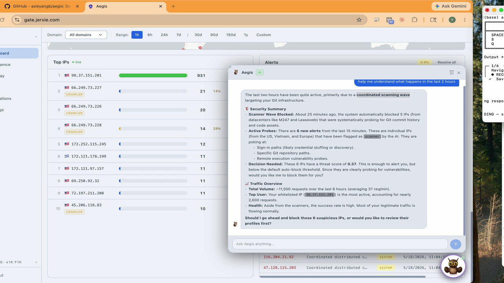
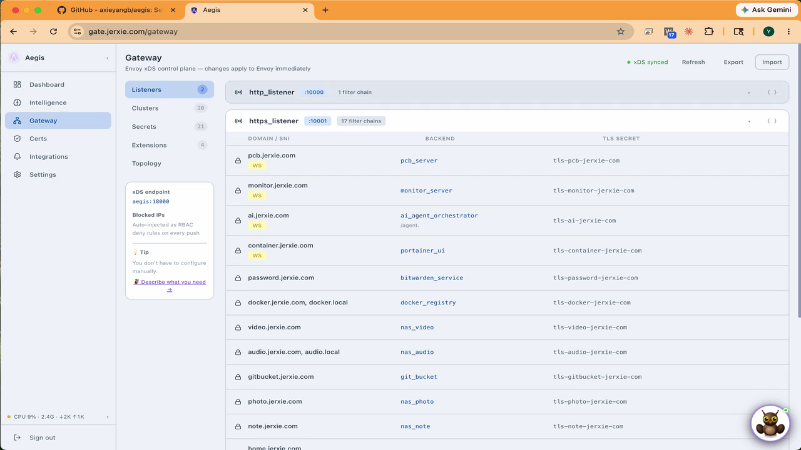
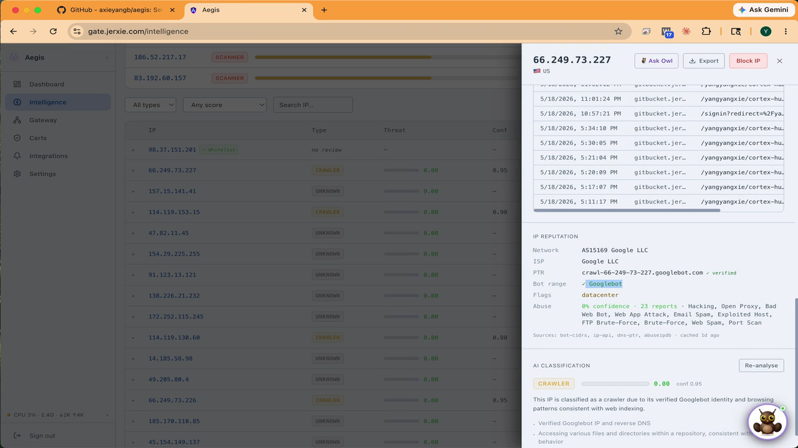
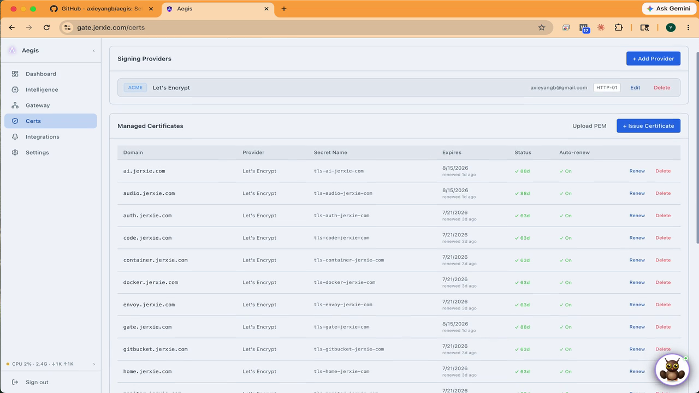
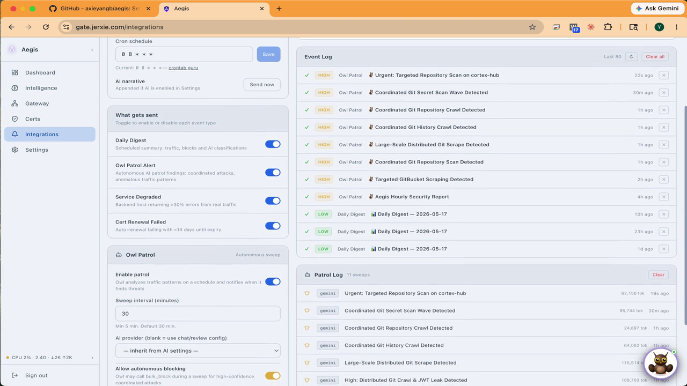
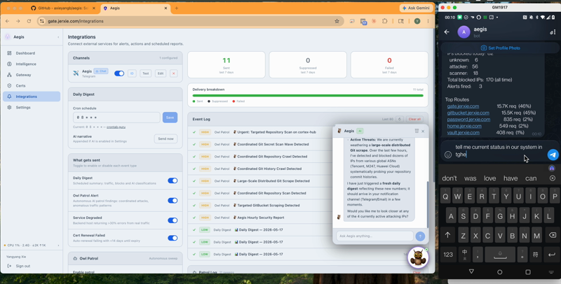

<p align="center">
  
</p>

<h1 align="center">Aegis</h1>

<p align="center">
  <strong>Self-hosted Envoy gateway · AI threat analysis · TLS automation · Real-time dashboard</strong>
</p>

<p align="center">
  <a href="https://hub.docker.com/r/axieyangb/aegis"></a>
  <a href="https://hub.docker.com/r/axieyangb/aegis/tags"></a>
  <a href="LICENSE"></a>
</p>

<p align="center">
  Aegis sits between the internet and your services — one container that controls Envoy Proxy in real time, blocks threats automatically, manages TLS certificates, and lets you chat with your gateway through an AI assistant.
</p>

---


---

## Quick start

```bash
mkdir aegis && cd aegis

curl -O https://raw.githubusercontent.com/axieyangb/aegis/main/docker-compose.yml
mkdir envoy
curl -o envoy/envoy.yaml https://raw.githubusercontent.com/axieyangb/aegis/main/envoy/envoy.yaml

docker compose up -d
```

Open **`http://localhost:8765`** — default login: `admin` / `changeme`.

> Edit `docker-compose.yml` and set `ADMIN_PASSWORD` before exposing to the network.

On first boot Aegis seeds a working gateway baseline — HTTP (port 10080) and HTTPS (port 10443) listeners ready to accept filter chains.

---

## Features

<table>
<tr>
<td align="center" width="50%">

**🦉 Owl AI Assistant**



Chat with your gateway in plain English. Owl analyses traffic, surfaces threats, and can configure your gateway end-to-end — clusters, certs, filter chains — from a single prompt.

</td>
<td align="center" width="50%">

**🛡 Envoy Gateway Control**



Visual editor for listeners, filter chains, and clusters. Changes are validated and pushed live to Envoy via xDS — no restarts, no YAML files.

</td>
</tr>
<tr>
<td align="center" width="50%">

**🔍 IP Intelligence**



Every IP auto-profiled: geolocation, ASN, VPN/Tor detection, AbuseIPDB score, and full request history. AI patrol sweeps run in the background and auto-block threats.

</td>
<td align="center" width="50%">

**🔒 TLS Automation**



ACME auto-renewal (Let's Encrypt, ZeroSSL), HTTP-01 & DNS-01 challenges, and a built-in Local CA for internal services — all pushed directly to Envoy SDS.

</td>
</tr>
<tr>
<td align="center" width="50%">

**🔔 AI Patrol & Alerts**



Scheduled AI sweeps classify traffic around the clock. Blocks and anomalies are pushed to Telegram, Discord, Slack, or webhook.

</td>
<td align="center" width="50%">

**📱 Mobile-ready**



Full dashboard and Owl chat from any device. Ask Owl what happened in the last two hours — it triages threats, blocks IPs, and confirms — all from your phone.

</td>
</tr>
</table>

---

## Architecture

```
Internet ──▶ Envoy Proxy ──▶ Your services
                  │
          gRPC xDS (port 18000)
                  │
             ┌────▼─────┐
             │  Aegis   │  port 8765
             │          │
             │ xDS CP   │  controls Envoy live
             │ Analytics│  reads Envoy ALS logs
             │ AI Engine│  classifies IPs
             │ Cert Mgr │  ACME + Local CA → Envoy SDS
             │ Dashboard│  web UI + REST API
             └──────────┘
```

`linux/amd64` and `linux/arm64` — runs on x86 servers, Raspberry Pi, Synology NAS, and Apple Silicon.

---

## Configuration

| Variable | Default | Description |
|---|---|---|
| `PORT` | `8765` | Dashboard + API port |
| `XDS_PORT` | `18000` | Envoy gRPC xDS port |
| `DATA_DIR` | `/data` | Persistent data directory |
| `ADMIN_USERNAME` | `admin` | Admin username |
| `ADMIN_PASSWORD` | `aegis` | Admin password — **change this** |
| `AUTH_ENABLED` | `true` | Require login |
| `BLOCK_ENABLED` | `true` | Enable auto IP blocking |
| `NODE_ID` | `home` | Envoy node ID (must match envoy.yaml) |

Data is persisted at `/data/aegis.db` (SQLite). Mount a volume to keep data across container updates.

---

## Docs & Tutorials

- [Getting started](docs/getting-started.md)
- [Envoy configuration](docs/envoy-config.md)
- [AI setup — Owl chat + threat analysis](docs/ai-setup.md)
- [Notifications — Telegram, Discord, webhooks](docs/notifications.md)

### Tutorial series: Exposing a service with Aegis

| # | Tutorial | Description |
|---|---|---|
| 01 | [Local HTTPS with a whoami service](docs/tutorials/01-whoami-local-https.md) | Configure the gateway manually through the UI |
| 02 | [Configure the Gateway with Owl AI](docs/tutorials/02-whoami-ai-setup.md) | Same setup — let Owl AI do the configuration from a single prompt |
| 03 | [Understanding the Dashboard](docs/tutorials/03-understanding-the-dashboard.md) | Read live traffic data and analyse request patterns with Owl |
| 04 | [AI-Driven Protection](docs/tutorials/04-ai-driven-protection.md) | Use Owl to disable a service under attack and bring it back |

### Videos

<table>
<tr>
<td align="center" width="50%">

[](https://youtu.be/wE7uO7stkew)

**[Self-Host a Service with HTTPS](https://youtu.be/wE7uO7stkew)**<br>
Install Aegis, port-forward your router, set up No-IP DDNS, and issue a Let's Encrypt cert — ending with a live public HTTPS service.

</td>
<td align="center" width="50%">

[](https://youtu.be/lWCgecbXxjU)

**[AI Configures HTTPS Gateway and TLS Certificates](https://youtu.be/lWCgecbXxjU)**<br>
One prompt to Owl AI sets up the cluster, issues a certificate, and wires the filter chain — no YAML, no restarts.

</td>
</tr>
</table>

---

## License

Distributed as a compiled binary. Source code is proprietary. See [LICENSE](LICENSE).

Community tier is **free forever**. Pro unlocks unlimited notification channels, longer log retention, and unlimited AI patrol sweeps.

---

## About

Built by **Jerry Xie** — formerly network security at Palo Alto Networks, now Senior Software Engineer specialising in identity, distributed cloud, Kubernetes, and AI. Aegis started as a home lab project and grew into a product.

**Issues & feature requests:** [GitHub Issues](https://github.com/axieyangb/aegis/issues)  
**Enterprise / custom integrations:** [yyangxie@gmail.com](mailto:yyangxie@gmail.com)
