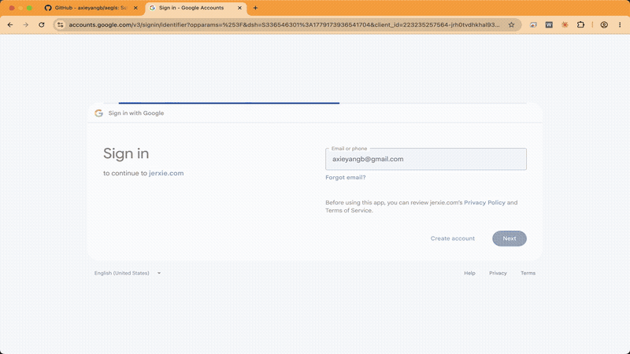
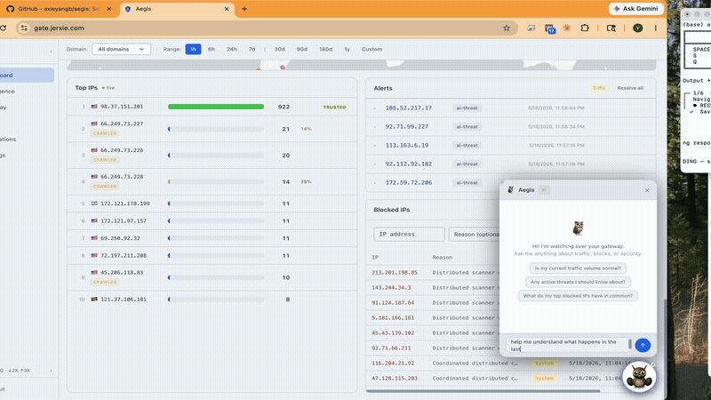
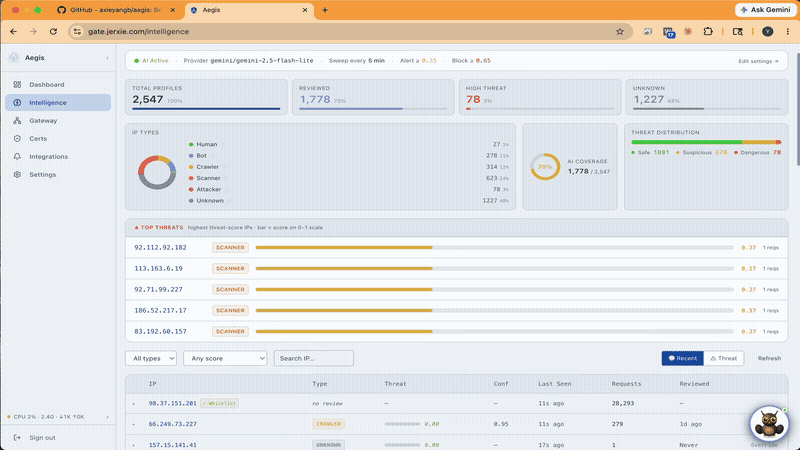
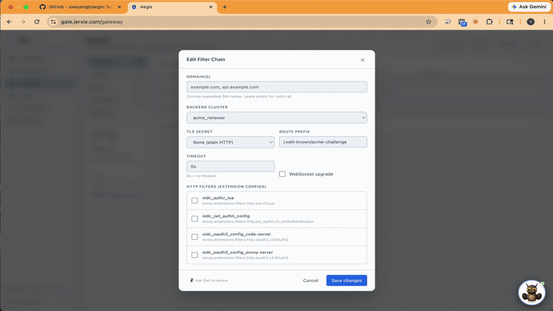
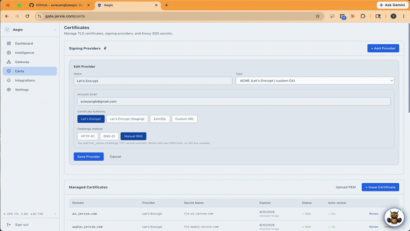
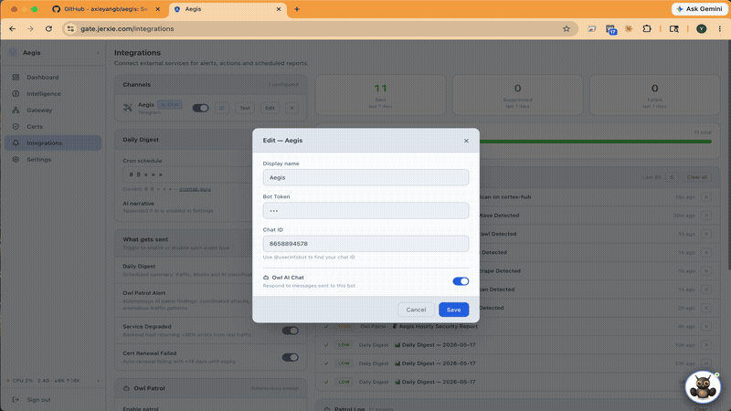
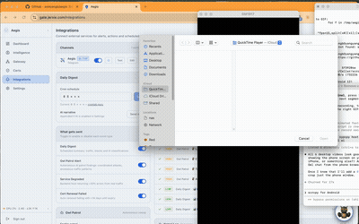

<p align="center">
  
</p>

<h1 align="center">Aegis</h1>

<p align="center">
  <strong>Self-hosted Envoy gateway with AI threat analysis, TLS automation, and a real-time security dashboard.</strong>
</p>

<p align="center">
  <a href="https://hub.docker.com/r/axieyangb/aegis"></a>
  <a href="https://hub.docker.com/r/axieyangb/aegis/tags"></a>
  <a href="LICENSE"></a>
</p>

Aegis sits between the internet and your services. It controls Envoy Proxy via xDS, watches all traffic in real time, blocks malicious IPs automatically, manages TLS certificates, and lets you chat with your gateway through an AI assistant — all in a single Docker container.

---

## Quick start

### 1. Download the starter files

Create a directory and download the required files:

```bash
mkdir aegis && cd aegis

# Download docker-compose config
curl -O https://raw.githubusercontent.com/axieyangb/aegis/main/docker-compose.yml

# Download Envoy static bootstrap config
mkdir envoy
curl -o envoy/envoy.yaml https://raw.githubusercontent.com/axieyangb/aegis/main/envoy/envoy.yaml

# Download baseline database configuration (for real production users)
mkdir configs
curl -o configs/starter.json https://raw.githubusercontent.com/axieyangb/aegis/main/configs/starter.json
```

### 2. Start the gateway

```bash
mkdir aegis && cd aegis

curl -O https://raw.githubusercontent.com/axieyangb/aegis/main/docker-compose.yml
mkdir envoy
curl -o envoy/envoy.yaml https://raw.githubusercontent.com/axieyangb/aegis/main/envoy/envoy.yaml
```

Edit `docker-compose.yml` and change `ADMIN_PASSWORD=changeme` to something secure, then:

```bash
docker compose up -d
```

Open **`http://localhost:8765`** — default login: `admin` / `changeme` (or the password you set).

On first boot, Aegis automatically seeds a working gateway baseline — HTTP listener (port 10080) and HTTPS listener (port 10443) — ready to accept filter chains. No file import required.

---

## Features in Action

### Live Traffic Dashboard

Real-time request feed, top-IP leaderboard, world traffic map, and live blocking activity — all in one view.

---

### Owl AI Assistant

Ask your gateway anything in plain English. Owl analyses current traffic, surfaces threats, and recommends exactly what to tighten — no dashboards to dig through.

---

### IP Intelligence

Every IP automatically profiled: geolocation, ASN, VPN/Tor detection, AbuseIPDB reputation score, and full request history. Click any IP to deep-dive, then ask Owl to triage it in context.

---

### Gateway Control Plane

Full Envoy xDS control — live topology view, listeners, filter chains, clusters, and extensions. See exactly which clusters are in use and by how many chains. No YAML editing required.

---

### TLS Certificate Automation

ACME auto-renewal via Let's Encrypt or ZeroSSL, delivered straight to Envoy SDS. Stuck on HTTP-01 prerequisites? Ask Owl to walk you through it step by step.

---

### AI Patrol Sweeps

Scheduled AI sweeps monitor your traffic around the clock. Threats get triaged automatically and pushed to your notification channels — Telegram, Discord, Slack, or webhook.

---

### Mobile: Owl on the Go

Open the dashboard on your phone, ask Owl what happened in the last two hours, and watch it triage the threats, block the bad IPs, and confirm the blocks — all from a single chat.

---

## Features

| | Feature | Description |
|---|---|---|
| 🛡 | **Envoy xDS Control Plane** | Visual editor for listeners, clusters, filter chains — pushed live via gRPC |
| 📊 | **Real-time Analytics** | Live request feed, top IPs, world map, device + status breakdown |
| 🤖 | **AI Threat Analysis** | Background IP classification using Gemini / Claude / GPT / Ollama. Auto-blocks attackers |
| 🦉 | **Owl AI Assistant** | Chat with your gateway — ask about traffic, threats, config, anything |
| 🔒 | **TLS Automation** | ACME (Let's Encrypt, ZeroSSL), HTTP-01 & DNS-01, auto-renewal via Envoy SDS. Built-in Local CA for internal services — no domain or open ports required |
| 🔔 | **Notifications** | Telegram, Discord, Slack webhooks — alert on blocks, anomalies, daily digest |
| 🌍 | **Geo Analytics** | Country-level traffic breakdown, remote or local MaxMind GeoIP |
| 🔑 | **Auth & SSO** | Built-in login + optional OIDC/SSO (Google, Authentik, Keycloak, etc.) |
| 🔍 | **IP Intelligence** | Per-IP profiles with ASN, ISP, VPN/Tor detection, AbuseIPDB reputation |
| 📱 | **Mobile-ready** | Full dashboard + Owl chat from any device — no native app required |

---

## Architecture

```
Internet ──▶ Envoy Proxy ──▶ Your services
                  │
          gRPC xDS (port 18000)
                  │
             ┌────▼─────┐
             │  Aegis   │  port 8765
             │          │
             │ xDS CP   │  controls Envoy live
             │ Analytics│  reads Envoy ALS logs
             │ AI Engine│  classifies IPs
             │ Cert Mgr │  ACME + Local CA → Envoy SDS
             │ Dashboard│  web UI + REST API
             └──────────┘
```

---

## TLS Certificates

### ACME (Let's Encrypt / ZeroSSL)

For internet-exposed domains. Aegis handles the full ACME lifecycle — issue, challenge, and auto-renew — and pushes the certificate directly to Envoy SDS. Supports HTTP-01 and DNS-01 challenges (Cloudflare, Route 53, GoDaddy).

### Local CA for internal / lab use

No domain, no open ports, no external CA required. Aegis generates a self-signed ECDSA Root CA on first use and issues 1-year leaf certificates instantly. Ideal for:

- Internal services and home lab setups
- Development and staging environments
- Proxying local services over TLS without exposing ports

Go to **Certificates → Signing Providers → Add Provider**, choose **Local CA**, and issue a cert in seconds. Download the Root CA from the Certificates page to install it in your browser or OS trust store.

**Bring your own CA**: If you already have a corporate or internal CA, you can import it — go to **Certificates → Local CA → Import CA** and upload your CA cert and private key. Aegis will use your CA to sign all leaf certs going forward.

---

## Configuration

### Environment variables

| Variable | Default | Description |
|---|---|---|
| `PORT` | `8765` | Dashboard + API port |
| `XDS_PORT` | `18000` | Envoy gRPC xDS port |
| `DATA_DIR` | `/data` | Persistent data directory |
| `ADMIN_USERNAME` | `admin` | Admin username |
| `ADMIN_PASSWORD` | `aegis` | Admin password (docker-compose.yml ships with `changeme`) — **change this** |
| `AUTH_ENABLED` | `true` | Require login |
| `BLOCK_ENABLED` | `true` | Enable auto IP blocking |
| `NODE_ID` | `home` | Envoy node ID (must match envoy.yaml) |

### Data volume

Mount a volume or directory to `/data`:

```
/data/
├── aegis.db        ← SQLite (traffic, certs, config, alerts)
└── skills/         ← Optional: override Owl AI knowledge files
    └── site.md     ← Custom context injected into Owl's system prompt
```

---

## Docs

- [Getting started](docs/getting-started.md)
- [Envoy configuration](docs/envoy-config.md)
- [AI setup (Owl chat + threat analysis)](docs/ai-setup.md)
- [Notifications (Telegram, Discord, webhooks)](docs/notifications.md)

### Tutorials

| # | Tutorial | Description |
|---|---|---|
| 01 | [Local HTTPS with a whoami service](docs/tutorials/01-whoami-local-https.md) | Expose a service over HTTPS using the Local CA — configure manually through the UI |
| 02 | [Configure the Gateway with Owl AI](docs/tutorials/02-whoami-ai-setup.md) | Same setup, but hand a single prompt to Owl and let AI do the configuration |

---

## Multi-arch

`linux/amd64` and `linux/arm64` — runs on x86 servers, Raspberry Pi, Synology NAS, and Apple Silicon.

```bash
# Pin a specific version
docker pull axieyangb/aegis:v1.0.0

# Always latest
docker pull axieyangb/aegis:latest
```

---

## License

Aegis is distributed as a compiled binary. Source code is proprietary. See [LICENSE](LICENSE).

Community tier is **free forever**. A Pro license unlocks unlimited notification channels, longer log retention, and unlimited AI patrol sweeps.

---

## About the Author

Aegis is designed and built by **Jerry Xie** — formerly a network security engineer at **Palo Alto Networks**, now a Senior Software Engineer specialising in identity, distributed cloud, Kubernetes, networking, and AI.

Outside of work: smart home automation, DIY racing drones, home lab tinkering, 3D printing, CNC machining, PCB design, and robotics. Aegis started as a home lab project and grew into a product.

---

## Support & Enterprise

*   **Issues & feature requests**: [GitHub Issues](https://github.com/axieyangb/aegis/issues)
*   **Enterprise collaboration, custom integrations, or just want to know more**: [yyangxie@gmail.com](mailto:yyangxie@gmail.com)
