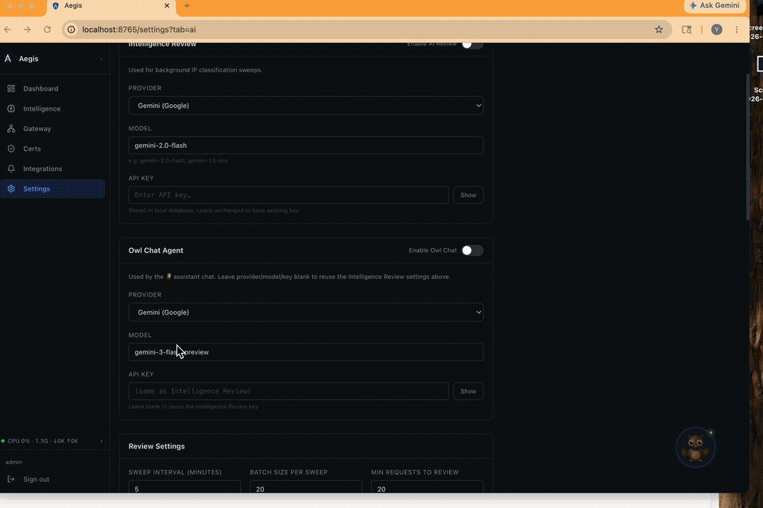
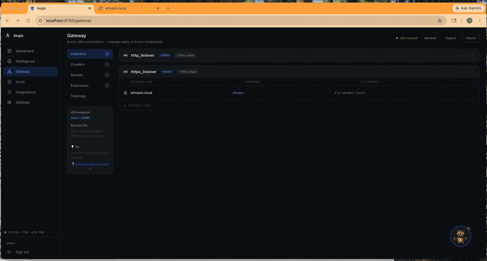

# Tutorial Series: Exposing a Service with Aegis

| # | Tutorial | Description |
|---|---|---|
| 1 | [Local HTTPS with a whoami service](01-whoami-local-https.md) | Configure the gateway manually through the UI |
| **2** | **Configure the Gateway with Owl AI** ← you are here | Let Owl AI do the configuration for you |

---

# Part 2 — Configure the Gateway with Owl AI

> **Prerequisite:** Complete [Part 1 — Local HTTPS with a whoami service](01-whoami-local-https.md) first to understand what we're building. This tutorial sets up the same thing — but Owl AI does the configuration for you.

Instead of clicking through the UI, you describe what you want to Owl and it handles the gateway configuration end-to-end: cluster, certificate, and filter chain.

**You will:**
1. Run a `whoami` container
2. Hand one prompt to Owl AI
3. Add a `/etc/hosts` entry
4. Access `https://whoami.local` from your browser

---

## Prerequisites

- Docker and Docker Compose installed
- Aegis + Envoy already running and accessible at `http://localhost:8765`
- Admin access to add an `/etc/hosts` entry on your machine

### Configure Owl Chat (first time only)

Go to **Settings → AI → Owl Chat**, enable it, pick a provider (e.g. Gemini), enter your API key, and save. Owl will immediately show as ready (green dot).



Once configured you can ask Owl questions about recent traffic — it has live access to your gateway logs and threat intelligence.

---

## Step 1 — Run the whoami container

Same as the manual tutorial — start `whoami` as a standalone container:

```bash
docker run -d --name whoami -p 8081:80 --restart unless-stopped traefik/whoami
```

---

## Step 2 — Ask Owl to set everything up

Open the Owl chat panel (🦉 button, bottom-right) and paste this prompt:

```
Set up whoami on my gateway: create a cluster named whoami with type STRICT_DNS,
host host.docker.internal, port 8081, connect timeout 5s, and advanced params
{"dnsLookupFamily":"V4_ONLY"}; then create a Local CA provider if one doesn't
exist; issue a TLS cert for whoami.local with auto-renew; finally add a filter
chain to https_listener for domain whoami.local routing to the whoami cluster
using the issued cert's secret name.
```

Owl will walk through each step, confirm with you before making changes, and report back when done.



---

## Step 3 — Trust the Root CA

If this is your first Local CA certificate, download and install the Root CA so your browser trusts it.

**Option A — from the UI:** Go to **Certificates → Signing Providers**, click **Download CA Cert** next to your Local CA provider.

**Option B — via curl:**
```bash
curl -s http://localhost:8765/api/certs/ca -o aegis-local-ca.crt
```

Then install it:

**macOS:**
```bash
sudo security add-trusted-cert -d -r trustRoot -k /Library/Keychains/System.keychain aegis-local-ca.crt
```

**Linux:**
```bash
sudo cp aegis-local-ca.crt /usr/local/share/ca-certificates/aegis-local-ca.crt
sudo update-ca-certificates
```

**Windows (PowerShell as Administrator):**
```powershell
Import-Certificate -FilePath aegis-local-ca.crt -CertStoreLocation Cert:\LocalMachine\Root
```

Restart your browser after installing the CA.

---

## Step 4 — Add an `/etc/hosts` entry

```bash
# Local machine
echo "127.0.0.1  whoami.local" | sudo tee -a /etc/hosts

# Or remote host (replace with actual IP)
echo "192.168.1.100  whoami.local" | sudo tee -a /etc/hosts
```

On Windows, edit `C:\Windows\System32\drivers\etc\hosts` as Administrator.

---

## Step 5 — Open in browser

Navigate to **`https://whoami.local`**.

You should see the whoami response served over HTTPS with a valid locally-trusted certificate — configured entirely by Owl.

---

## What just happened

```
You (one prompt)
    │
    ▼
Owl AI
    ├─ gateway_upsert_cluster      → created "whoami" cluster
    ├─ certs_create_provider       → created Local CA (if needed)
    ├─ certs_issue_cert            → issued tls-whoami-local
    └─ gateway_upsert_filter_chain → added filter chain to https_listener
                                        │
                                        ▼
                                 Envoy (port 10443)
                                        │
                                        ▼
                                 whoami container (port 80)
```

Owl used Aegis's MCP tools to make each change atomically. Every step was validated against the Envoy proto schema and pushed live via xDS — no restarts, no YAML files.

---

## Cleanup

Ask Owl to clean up for you:

```
Remove the whoami setup: delete the whoami.local filter chain from https_listener,
delete the whoami.local managed cert, and delete the whoami cluster.
```

Or do it manually:

1. Delete the filter chain from `https_listener` in Gateway → Listeners
2. Delete the managed cert in Certificates
3. Delete the `whoami` cluster in Gateway → Clusters
4. Remove the `/etc/hosts` line
5. Stop the whoami container: `docker rm -f whoami`

---

**← [Part 1 — Local HTTPS with a whoami service](01-whoami-local-https.md)**

**[Part 3 → Understanding the Dashboard](03-understanding-the-dashboard.md)**
