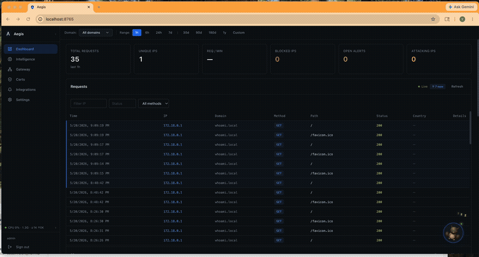

# Tutorial Series: Exposing a Service with Aegis

| # | Tutorial | Description |
|---|---|---|
| 1 | [Local HTTPS with a whoami service](01-whoami-local-https.md) | Configure the gateway manually through the UI |
| 2 | [Configure the Gateway with Owl AI](02-whoami-ai-setup.md) | Let Owl AI do the configuration from a single prompt |
| **3** | **Understanding the Dashboard** ← you are here | Read live traffic data and use Owl to analyse request patterns |

---

# Part 3 — Understanding the Dashboard

> **Prerequisite:** Complete [Part 1](01-whoami-local-https.md) or [Part 2](02-whoami-ai-setup.md) so you have a live service sending traffic through Aegis.

This tutorial walks through every section of the Aegis dashboard using real traffic from `whoami.local`. You'll generate requests, watch them flow through the dashboard, and ask Owl to analyse the IP pattern.

---

## Step 1 — Generate some traffic

Open `https://whoami.local` in your browser and refresh the page several times. Each refresh is one HTTP request flowing through Envoy into Aegis.

---

## Step 2 — Live Request Feed

The top panel shows every request as it arrives — method, path, status code, response time, and source IP. Requests from your browser appear within a second of hitting Envoy.

**What to look for:**
- `GET /` → `200` from your browser IP — confirms the whoami service is healthy
- Response time in the low milliseconds — Envoy adds almost zero overhead
- The source IP shown is your machine's IP (or Docker bridge if testing locally)

---

## Step 3 — Top IPs leaderboard

The leaderboard ranks IPs by total request count. After a few refreshes your IP will appear at the top.

Click your IP to open the **IP Intelligence** panel — Aegis automatically looks up geolocation, ASN, and checks AbuseIPDB. For your own IP it should show:
- Country and ISP matching your network
- Reputation score near 0 (clean)
- Request history from this session

---

## Step 4 — Traffic breakdown panels

| Panel | What it shows |
|---|---|
| **Status codes** | 2xx/3xx/4xx/5xx split — all green means no errors |
| **HTTP methods** | GET/POST/etc. distribution |
| **Top paths** | Most-requested URLs — useful for spotting scanners hitting `/admin`, `/.env`, etc. |
| **Country map** | Geographic origin of requests — your country should light up |
| **Device types** | Browser, bot, API client classification based on User-Agent |

---

## Step 5 — Ask Owl to analyse the pattern

Open Owl (🦉 bottom-right) and ask:

> What does the recent traffic from my IP look like? Is there anything suspicious?

Owl queries the live traffic data, checks the IP intelligence profile, and gives a verdict. For normal browser traffic it should respond with something like:

> *"The traffic from [your IP] looks like normal browser activity — consistent GET requests to `/`, standard browser User-Agent, low request rate, clean reputation score. No action needed."*

This is exactly what threat analysis looks like for legitimate traffic — Owl confirms it's safe so you know what a clean profile looks like before comparing it to actual attack traffic.

---

## What you've seen

| Dashboard section | Meaning |
|---|---|
| Live feed | Real-time visibility into every request Envoy handles |
| Top IPs | Who is hitting your gateway and how often |
| IP Intelligence | Automatic reputation and geolocation for any source IP |
| Breakdown panels | Traffic health at a glance — status codes, paths, countries |
| Owl analysis | AI verdict on any IP pattern — safe, suspicious, or block |

---

## Next

There is no next tutorial in this series yet — but you now have a working HTTPS service, an AI-configured gateway, and a live understanding of your traffic dashboard.

Explore from here:
- Try sending malformed requests and watch Owl's threat score rise
- Set up [AI patrol sweeps](../ai-setup.md) to classify traffic automatically in the background
- Configure [notifications](../notifications.md) to get alerted when Aegis blocks an IP

---

**← [Part 2 — Configure the Gateway with Owl AI](02-whoami-ai-setup.md)**
