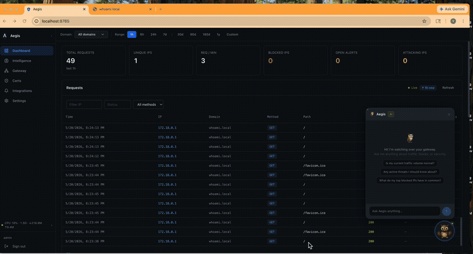

# Tutorial Series: Exposing a Service with Aegis

| # | Tutorial | Description |
|---|---|---|
| 1 | [Local HTTPS with a whoami service](01-whoami-local-https.md) | Configure the gateway manually through the UI |
| 2 | [Configure the Gateway with Owl AI](02-whoami-ai-setup.md) | Let Owl AI do the configuration from a single prompt |
| 3 | [Understanding the Dashboard](03-understanding-the-dashboard.md) | Read live traffic data and analyse request patterns with Owl |
| **4** | **AI-Driven Protection — Disable & Re-enable a Service** ← you are here | Use Owl to take a service offline under attack and bring it back |

---

# Part 4 — AI-Driven Protection: Disable & Re-enable a Service

> **Prerequisite:** Complete [Part 1](01-whoami-local-https.md) or [Part 2](02-whoami-ai-setup.md) so you have `whoami.local` running and accessible.

When a DDoS or targeted attack hits one of your services, the fastest response is to pull it offline at the gateway — no firewall rules, no server changes, just one command to Owl. The service goes dark in under a second. Once the attack subsides, Owl brings it back just as fast.

This tutorial demonstrates the full cycle: disable a cluster, verify the service is unreachable, then re-enable it.

---

## Step 1 — Ask Owl to disable the cluster

Open the Owl chat panel (🦉 bottom-right) and type:

> Disable the whoami cluster

Owl will call `gateway_toggle_resource` to disable the cluster. Aegis immediately rebuilds the xDS snapshot without it — Envoy stops routing to `whoami` within ~1 second.

---

## Step 2 — Verify the service is unreachable

Open `https://whoami.local` in your browser. You should see a **503 Service Unavailable** — Envoy has no healthy upstream for the filter chain.

This is exactly what happens during a DDoS response: the service is shielded at the gateway layer while the backend stays untouched.

---

## Step 3 — Ask Owl to re-enable the cluster

Once you're ready to bring it back:

> Re-enable the whoami cluster

Owl toggles the cluster back on. Aegis pushes the updated snapshot to Envoy and `https://whoami.local` is accessible again within a second.

---

## Why this matters

| Scenario | How Owl helps |
|---|---|
| **DDoS targeting one service** | Disable that cluster — attackers hit a 503, backend is protected |
| **Vulnerability disclosed overnight** | Owl can pull affected services offline while you patch |
| **Maintenance window** | Disable cleanly from chat, no SSH or YAML edits |
| **Gradual re-enable after incident** | Re-enable, watch dashboard, disable again if attack resumes |

The key advantage: this operates at the **xDS layer**. Disabling a cluster removes it from Envoy's routing table entirely — no lingering connections, no half-open sockets. The backend process keeps running; only the gateway path is cut.

---

## AI Patrol automation

Rather than waiting for you to notice an attack, Aegis can detect and respond automatically. When the AI patrol sweep identifies a high-threat pattern — flood of requests, known scanner signatures, spike from a single ASN — it can be configured to:

1. Block individual IPs automatically (based on threat score thresholds)
2. Alert you via Telegram/Discord/Slack with a summary
3. Let you instruct Owl to disable the cluster via a single reply

Go to **Settings → AI** to configure patrol sweep thresholds and notification channels.

---

**← [Part 3 — Understanding the Dashboard](03-understanding-the-dashboard.md)**
